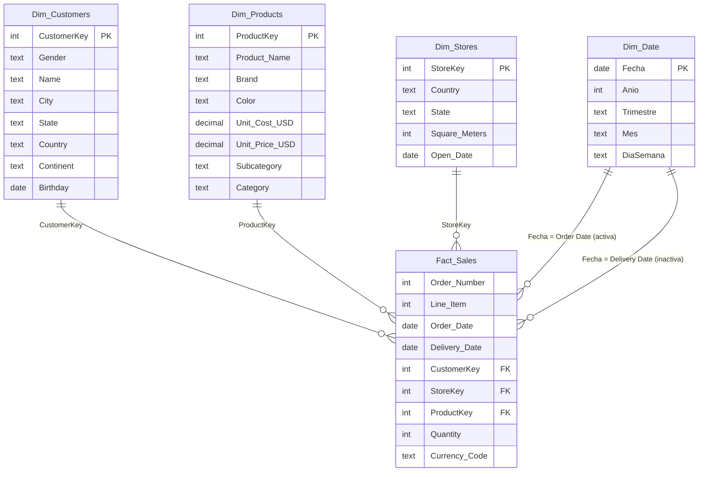

# Módulo 7 - DATA VISUALIZATION AND VISUAL ANALYTICS
**MCDIA - SOE UAGRM**

## GRUPO 2
### Integrantes del grupo:
- Oliver Camacho Velasco
- Griselda Merino Herbas
- Eberth Canaviri Calle
- Cristhian Ortiz Mercado
---

# Global Electronics — Modelo de datos en Power BI

## Contenido

- [El dataset](#el-dataset)
- [Estructura del repositorio](#estructura-del-repositorio)
- [Cómo abrir el proyecto](#cómo-abrir-el-proyecto)
- [Transformaciones en Power Query](#transformaciones-en-power-query)
- [Modelo de datos](#modelo-de-datos)
- [Totales de control](#totales-de-control)
- [Cómo trabajar en equipo](#cómo-trabajar-en-equipo)

---

## El dataset

Datos de ventas de **Global Electronics**, una cadena minorista ficticia de electrónica de consumo. Cada fila de ventas es una línea de pedido de un cliente que compró en una tienda física o en la tienda Online. Las marcas (Contoso, Adventure Works, Fabrikam, Northwind Traders, etc.) son marcas de ejemplo de Microsoft, así que los productos no son reales.

| Archivo | Filas | Contenido |
|---|---:|---|
| `Sales.csv` | 62.884 | Líneas de pedido (26.326 pedidos): fechas de pedido y entrega, cliente, tienda, producto, cantidad y moneda |
| `Customers.csv` | 15.266 | Género, nombre, ciudad, estado, código postal, país, continente y fecha de nacimiento |
| `Products.csv` | 2.517 | Nombre, marca, color, costo y precio unitario en USD, subcategoría y categoría |
| `Stores.csv` | 67 | 66 tiendas físicas y 1 tienda Online (`StoreKey = 0`): país, estado, m² y fecha de apertura |
| `Exchange_Rates.csv` | 11.215 | Tipo de cambio diario respecto al USD (2015–2021) |
| `Data_Dictionary.csv` | 37 | Descripción de cada campo |

**Alcance**

- **Periodo:** 1 de enero de 2016 al 20 de febrero de 2021 (2021 está incompleto).
- **Países:** Estados Unidos, Canadá, Reino Unido, Alemania, Francia, Italia, Países Bajos y Australia.
- **Monedas:** USD, EUR, GBP, CAD y AUD.
- **Productos:** 8 categorías, 32 subcategorías y 11 marcas.

**Particularidades de los datos**

- `Delivery Date` solo existe para las ventas **Online**. Las ventas en tienda física no tienen fecha de entrega.
- La tienda Online no tiene metros cuadrados (`Square Meters` vacío).
- Los precios vienen como texto con formato de moneda (`"$2,899.99 "`).
- Las fechas vienen en formato de EE. UU. (`M/D/YYYY`).
- `Customers.csv` usa codificación **Windows-1252**; el resto, UTF-8.
- `Data_Dictionary.csv` usa `;` como separador; el resto, `,`.

> ⚠️ **No conviertan los CSV a Excel.** Si se abren y guardan en Excel con configuración regional en español, las fechas con día ≤ 12 se invierten (por ejemplo, `7/3/1939` pasa de 3 de julio a 7 de marzo). El modelo lee directamente los CSV originales de la carpeta `data/`.

---

## Estructura del repositorio

```
.
├── data/                       # CSV originales (no modificar)
│   ├── Customers.csv
│   ├── Data_Dictionary.csv
│   ├── Exchange_Rates.csv
│   ├── Products.csv
│   ├── Sales.csv
│   └── Stores.csv
├── powerbi/
│   └── MCDIA_M7_GRUPO2.pbix    # Modelo de datos
├── .gitattributes              # Evita que Git modifique los CSV y el .pbix
├── .gitignore
└── README.md
```

El `.gitattributes` marca los CSV y el `.pbix` como binarios. Así Git no cambia los saltos de línea ni la codificación de los archivos al subirlos o bajarlos, algo importante porque `Customers.csv` está en Windows-1252.

---

## Cómo abrir el proyecto

**Requisitos:** Windows con [Power BI Desktop](https://www.microsoft.com/es-es/power-platform/products/power-bi/desktop) (gratis; la versión de Microsoft Store se actualiza sola).

1. Clona el repositorio:
   ```bash
   git clone <url-del-repo>
   ```
2. Abre `powerbi/MCDIA_M7_GRUPO2.pbix`.
3. La primera vez va a aparecer un error de **archivo no encontrado**, porque el `.pbix` guarda la ruta de la computadora donde se guardó por última vez. Apunta el modelo a tu carpeta `data/`:
   1. Abre la carpeta `data` de tu clon en el explorador de Windows, haz clic en la barra de direcciones y copia la ruta.
   2. En Power BI: **Inicio → Transformar datos ▾ → Editar parámetros**.
   3. En `RutaCarpeta`, pega la ruta y **agrégale `\` al final**. Por ejemplo:
      ```
      C:\Users\tu_usuario\repos\mcdia-m7-global-electronics-powerbi\data\
      ```
   4. **Aceptar → Aplicar cambios**.
4. Si Power BI pregunta por niveles de privacidad, elige **Ignorar** o **Público**; son archivos locales.

**Cómo funciona `RutaCarpeta`**

- Contiene **solo la carpeta**, sin el nombre de ningún archivo.
- Cada consulta le agrega el nombre de su CSV. Por ejemplo, `Dim_Customers` usa `RutaCarpeta & "Customers.csv"`, que da `...\data\Customers.csv`.
- Si falta la `\` final, la ruta queda `...\dataCustomers.csv` y Power BI no encuentra el archivo.
- Es la **única** configuración que cambia entre computadoras. No editen las rutas dentro de cada consulta.

---

## Transformaciones en Power Query

Todas las consultas leen los CSV con `Csv.Document(File.Contents(RutaCarpeta & "<archivo>.csv"), ...)` y convierten tipos con configuración regional **`en-US`**, para interpretar bien los decimales con punto y las fechas `M/D/YYYY`.

| Consulta | Transformaciones |
|---|---|
| `Dim_Customers` | Codificación 1252. `Birthday` a fecha. `Zip Code` como texto (hay códigos alfanuméricos). |
| `Dim_Products` | Quita `$` y espacios de `Unit Cost USD` y `Unit Price USD` y los convierte a número decimal. `SubcategoryKey` y `CategoryKey` como texto, para conservar los ceros a la izquierda. |
| `Dim_Stores` | `Open Date` a fecha. |
| `Aux_Exchange_Rates` | `Date` a fecha y `Exchange` a número. |
| `_Data_Dictionary` | Separador `;`. |
| `Fact_Sales` | `Order Date` y `Delivery Date` a fecha. Las ventas sin fecha de entrega (ventas en tienda) reciben la fecha centinela **31/12/3000**. |

> La fecha 31/12/3000 en `Delivery Date` significa **venta en tienda física**, no "pedido pendiente".

---

## Modelo de datos

Modelo estrella con `Fact_Sales` al centro.



| Tabla | Tipo | Notas |
|---|---|---|
| `Fact_Sales` | Hechos | Grano: una línea de pedido |
| `Dim_Customers` | Dimensión | |
| `Dim_Products` | Dimensión | Precios convertidos a número |
| `Dim_Stores` | Dimensión | `StoreKey = 0` es la tienda Online |
| `Dim_Date` | Dimensión | Tabla calculada en DAX, marcada como tabla de fechas (columna `Fecha`) |
| `Aux_Exchange_Rates` | Auxiliar | Sin relación con las demás tablas |
| `_Data_Dictionary` | Referencia | Oculta en la vista de informe |

**Relaciones**

| Desde | Hacia | Cardinalidad | Estado |
|---|---|---|---|
| `Fact_Sales[CustomerKey]` | `Dim_Customers[CustomerKey]` | N:1 | Activa |
| `Fact_Sales[ProductKey]` | `Dim_Products[ProductKey]` | N:1 | Activa |
| `Fact_Sales[StoreKey]` | `Dim_Stores[StoreKey]` | N:1 | Activa |
| `Fact_Sales[Order Date]` | `Dim_Date[Fecha]` | N:1 | Activa |
| `Fact_Sales[Delivery Date]` | `Dim_Date[Fecha]` | N:1 | Inactiva |

**`Dim_Date`**

- Cubre años completos, desde el primer pedido hasta la última entrega real.
- Columnas: `Fecha`, `Anio`, `Trimestre`, `TrimestreNum`, `MesNum`, `Mes`, `MesCorto`, `MesAnio`, `AnioMesNum`, `Dia`, `NumDiaSemana`, `DiaSemana`, `EsFinDeSemana`.
- Las columnas numéricas tienen **Resumir por: Ninguno**.
- `Mes` y `MesCorto` se ordenan por `MesNum`, `MesAnio` por `AnioMesNum`, `DiaSemana` por `NumDiaSemana` y `Trimestre` por `TrimestreNum`.
- "Fecha y hora automáticas" está desactivada en las opciones del archivo.

---

## Totales de control

Valores calculados directamente sobre los CSV originales, para comprobar que el modelo cargó completo. Se pueden verificar en la **Vista de consultas DAX** (último ícono de la barra izquierda) con:

```dax
EVALUATE
ROW (
    "Filas", COUNTROWS ( Fact_Sales ),
    "Pedidos", DISTINCTCOUNT ( Fact_Sales[Order Number] ),
    "Cantidad", SUM ( Fact_Sales[Quantity] ),
    "Ventas USD", SUMX ( Fact_Sales, Fact_Sales[Quantity] * RELATED ( Dim_Products[Unit Price USD] ) ),
    "Costo USD", SUMX ( Fact_Sales, Fact_Sales[Quantity] * RELATED ( Dim_Products[Unit Cost USD] ) )
)
```

| Indicador | Valor esperado |
|---|---:|
| Filas de `Fact_Sales` | 62.884 |
| Pedidos distintos | 26.326 |
| Cantidad total | 197.757 |
| Ventas USD | 55.755.479,59 |
| Costo USD | 23.092.791,21 |

Además:

- No hay ventas huérfanas: toda clave de `Fact_Sales` existe en su dimensión.
- No hay claves duplicadas en las dimensiones.
- Ventas Online: 13.165 líneas (todas con `Delivery Date`). Ventas en tienda: 49.719 líneas (ninguna con `Delivery Date`).

---

## Cómo trabajar en equipo

El `.pbix` es un archivo **binario**: Git no puede combinar los cambios de dos personas. Si dos integrantes lo modifican a la vez, uno pierde su trabajo.

1. **Una persona edita el `.pbix` a la vez.** Avisen en el grupo antes de empezar ("tomo el pbix") y al terminar ("libero el pbix").
2. Antes de abrirlo, actualicen: `git pull`.
3. Al terminar, **guarden y cierren Power BI** y suban de inmediato:
   ```bash
   git add powerbi/MCDIA_M7_GRUPO2.pbix
   git commit -m "Describe aquí el cambio"
   git push
   ```
4. No suban cambios en `data/`: los CSV deben quedar tal como vienen.
